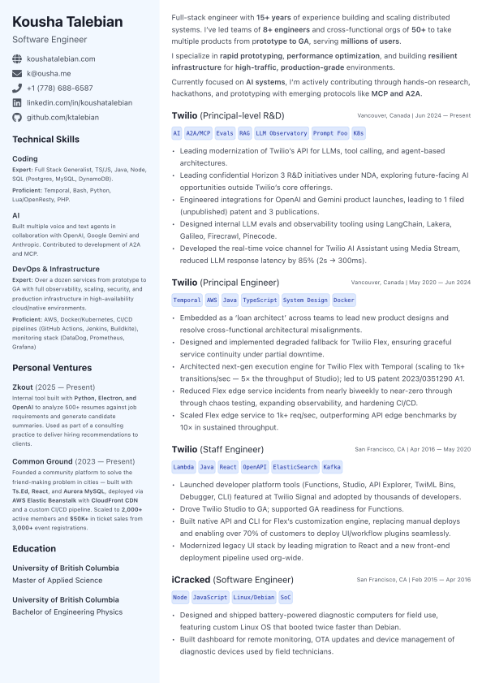

# resume-builder

Custom Resume builder used for my personal resume:

## Getting Started

1) Clone the repo
2) Modify [content/resume.json](content/resume.json)
3) Run `npm install` to install dependencies
4) Run `npm dev` to view/print the resume
